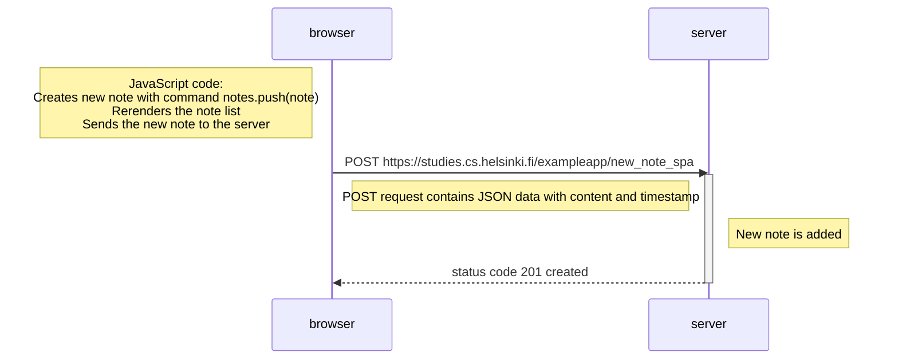

```mermaid
sequenceDiagram
    participant browser
    participant server

    Note left of browser: JavaScript code:<br>Creates new note with command notes.push(note)<br>Rerenders the note list<br>Sends the new note to the server
    
    browser->>server: POST https://studies.cs.helsinki.fi/exampleapp/new_note_spa
    activate server
    Note right of browser: POST request contains JSON data with content and timestamp
    Note right of server: New note is added
    server-->>browser: status code 201 created
    deactivate server
```